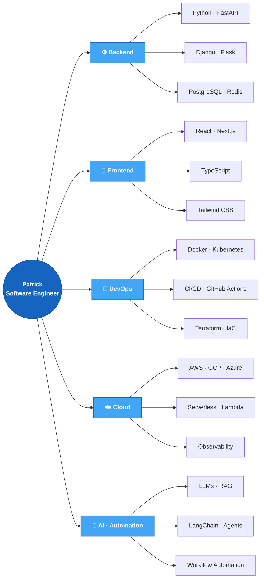
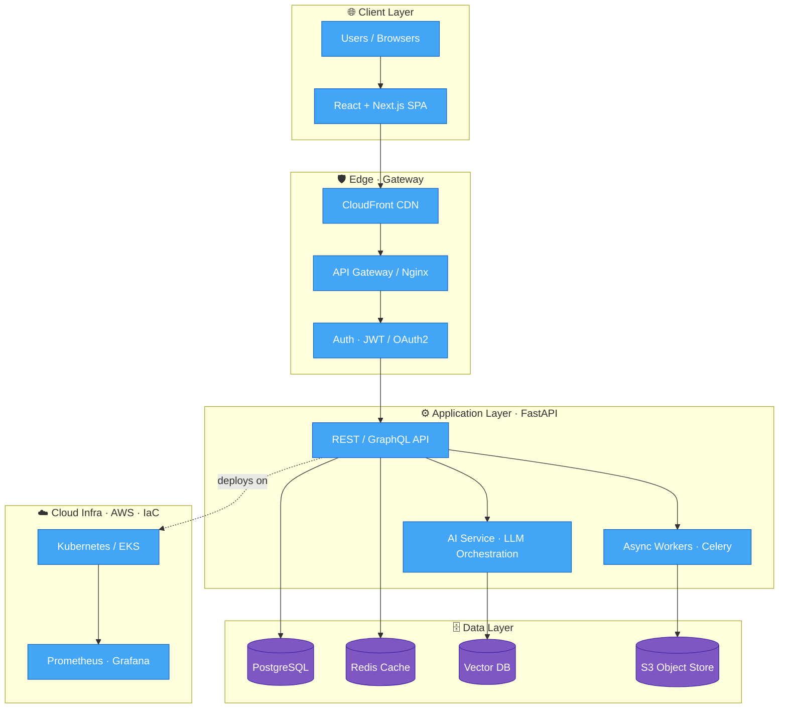
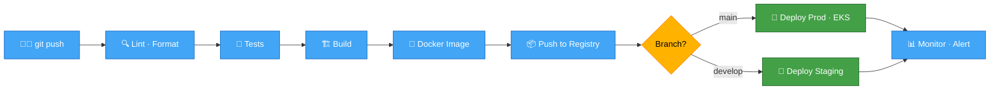
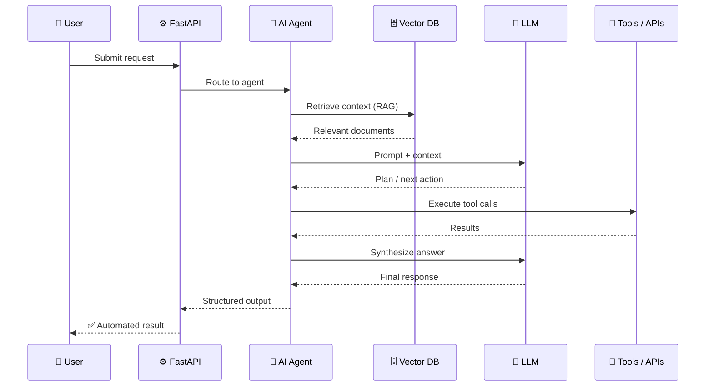

<!--
  ⚙️  SETUP — READ ME FIRST
  ──────────────────────────────────────────────────────────────
  1. Replace every "your-username" below with your real GitHub handle
     (Tip: open this file in any editor and Find & Replace "your-username").
  2. Replace social links (LinkedIn / email / website) with yours.
  3. This file belongs in a repo named EXACTLY the same as your username
     (e.g. github.com/patrick/patrick) so it shows on your profile.
  4. The "Snake" animation needs the GitHub Action at the bottom of this
     file — instructions are in the comment near that section.
  ──────────────────────────────────────────────────────────────
-->

<!-- ====================== HEADER BANNER ====================== -->
<div align="center">


<!-- ====================== TYPING ANIMATION ====================== -->
<a href="https://github.com/your-username">
  
</a>

<!-- ====================== PROFILE STATS BADGES ====================== -->
<p>
  
  <a href="https://github.com/your-username?tab=followers">
    
  </a>
  <a href="https://github.com/your-username">
    
  </a>
  
</p>

</div>

---

## 🧑‍💻 About Me

```python
class Patrick:
    def __init__(self):
        self.role        = "Senior Software Engineer"
        self.experience  = "12+ years (United States 🇺🇸)"
        self.languages   = ["Python", "JavaScript/TypeScript", "Go", "SQL"]
        self.specialties = {
            "backend"   : ["FastAPI", "Django", "REST", "GraphQL"],
            "frontend"  : ["React", "Next.js", "TypeScript"],
            "devops"    : ["Docker", "Kubernetes", "CI/CD", "Terraform"],
            "cloud"     : ["AWS", "GCP", "Azure"],
            "ai_ml"     : ["LLMs", "LangChain", "RAG", "Automation"],
        }
        self.mindset     = "Ownership across the full stack 🚀"

    def current_focus(self):
        return "Building scalable, AI-powered automation & cloud platforms"
```

- 🔭 I architect and ship **production systems** end-to-end — from API to infra.
- 🤖 I love wiring **AI into real workflows**: automation, agents, and intelligent tooling.
- ☁️ I design **cloud-native, DevOps-first** platforms that scale.
- 🌱 Always leveling up — currently deepening **LLM orchestration & platform engineering**.
- 💬 Ask me about **Python, FastAPI, React, CI/CD pipelines, or cloud architecture**.

---

## 🛠️ Tech Stack

<div align="center">

### Languages


### Backend & APIs


### Frontend


### DevOps, Cloud & AI


<br/>

<!-- Icon grid (skillicons.dev) -->


</div>

---

## 🧩 Skills & Expertise

<div align="center"><sub>A map of how I work across the stack — rendered live by GitHub.</sub></div>



---

## 🏗️ Featured Project — AI-Powered Cloud Platform

<div align="center"><sub>A representative architecture I design &amp; ship end-to-end. Swap this for one of your real systems.</sub></div>



---

## 🔄 CI/CD &amp; DevOps Workflow

<div align="center"><sub>How code goes from commit to production with zero manual steps.</sub></div>



---

## 🤖 AI Automation &amp; Agent Pipeline

<div align="center"><sub>An intelligent request flow: retrieval, reasoning, tool use, and synthesis.</sub></div>



---

<div align="center">

### 🤝 Let's build something great together


<sub>⭐️ From <a href="https://github.com/your-username">Patrick</a> — thanks for stopping by!</sub>

</div>
